## Инструмент ipcalc
 * 1.1. Сети и маски  
    Определи и запиши в отчёт:  

    + 1) Адрес сети 192.167.38.54/13 : 192.160.0.0/13  
        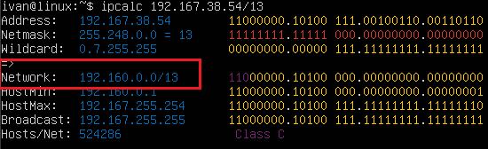 

    + 2) Перевод маски 255.255.255.0 в префиксную и двоичную запись: /24 11111111 11111111 11111111 00000000  
        /15 в обычную и двоичную: 255.254.0.0, 11111111 1111111 0 00000000 00000000  
        11111111.11111111.11111111.11110000 в обычную и префиксную: 255.255.255.240 , /28  

    + 3) Минимальный и максимальный хост в сети 12.167.38.4 при масках: /8, 11111111.11111111.00000000.00000000, 255.255.254.0 и /4  
        `HOSTMIN HOSTMAX for network 12.167.38.4 with mask /8, /16 , /23`  
        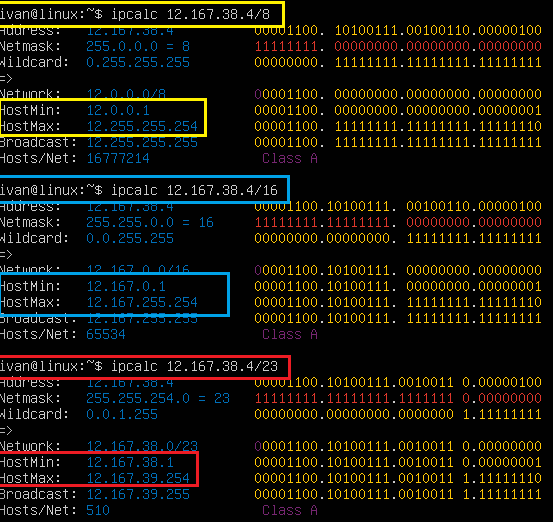  
        `HOSTMIN HOSTMAX for network 12.167.38.4 with mask /4`  
        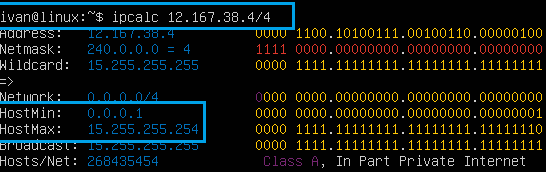  

 * 1.2. localhost  
    Определи и запиши в отчёт, можно ли обратиться к приложению, работающему на localhost, со следующими IP: 194.34.23.100, 127.0.0.2, 127.1.0.1, 128.0.0.1  

    127.0.0.2, 127.1.0.1 c этими ip можно обратиться к приложению, так как они находятся в диапазоне ip адресов предназначенных для localhost  
    `Диапазон localhost`  
    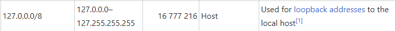  
    `Список localhost`  
    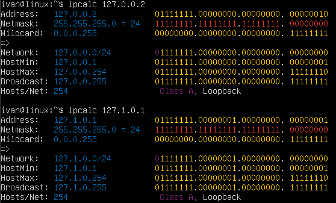  

 * 1.3. Диапазоны и сегменты сетей  
    Определи и запиши в отчёт:  
     + 1) Какие из перечисленных IP можно использовать в качестве публичного, а какие только в качестве частных: 10.0.0.45, 134.43.0.2, 192.168.4.2, 172.20.250.4, 172.0.2.1, 192.172.0.1, 172.68.0.2, 172.16.255.255, 10.10.10.10, 192.169.168.1  

     В качестве частных можно использовать следующие ip адреса: 10.0.0.45, 192.168.4.2, 172.20.250.4, 172.16.255.255, 10.10.10.10.  
      `Private networks`   
     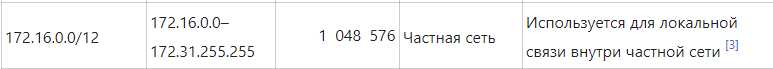  
     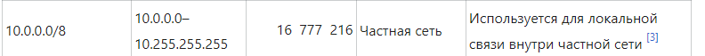  
     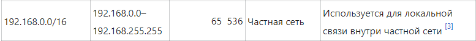  
      `10.0.0.45, 192.168.4.2, 172.20.250.4`  
      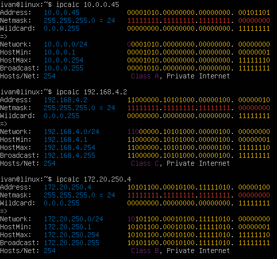  
      `172.16.255.255, 10.10.10.10`  
      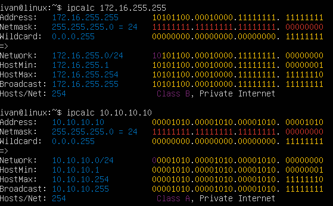  

     В качестве публичных можно использовать остальные ip адреса: 134.43.0.2,  172.0.2.1, 192.172.0.1, 172.68.0.2,  192.169.168.1.  
     `134.43.0.2,  172.0.2.1, 192.172.0.1`  
     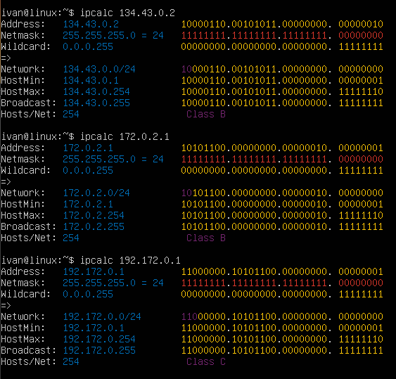  
     `172.68.0.2,  192.169.168.1`  
     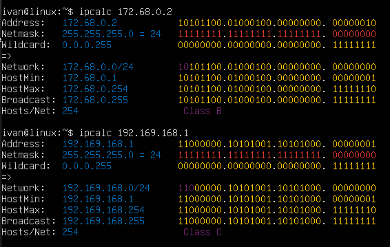  

     + 2) Какие из перечисленных IP адресов шлюза возможны у сети 10.10.0.0/18: 10.0.0.1, 10.10.0.2, 10.10.10.10, 10.10.100.1, 10.10.1.255  
        IP адресов шлюза возможных у сети 10.10.0.0/18: 10.10.0.2, 10.10.10.10.  
        `Диапазон ip в которых может находится шлюз`  
        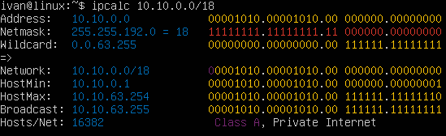  

## Part 2. Статическая маршрутизация между двумя машинами  

 * Подними две виртуальные машины (далее -- ws1 и ws2).  

    + С помощью команды ip a посмотри существующие сетевые интерфейсы  
    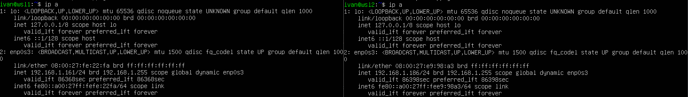  

    + Опиши сетевой интерфейс, соответствующий внутренней сети, на обеих машинах и задать следующие адреса и маски: ws1 - 192.168.100.10, маска /16, ws2 - 172.24.116.8, маска /12.  
    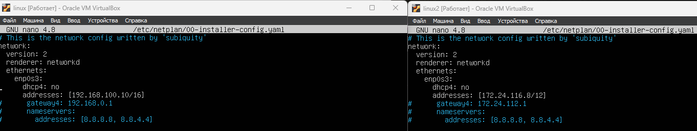  

    + Выполни команду netplan apply для перезапуска сервиса сети.  
      

 * 2.1. Добавление статического маршрута вручную  

    + Добавь статический маршрут от одной машины до другой и обратно при помощи команды вида ip r add.  

    + Пропингуй соединение между машинами.  
    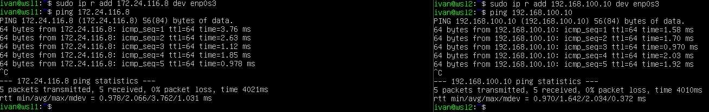  

 * 2.2. Добавление статического маршрута с сохранением  
    + Добавь статический маршрут от одной машины до другой с помощью файла etc/netplan/00-installer-config.yaml.  
    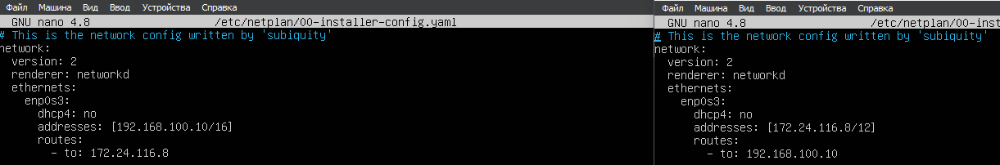  

    + Пропингуй соединение между машинами.  
    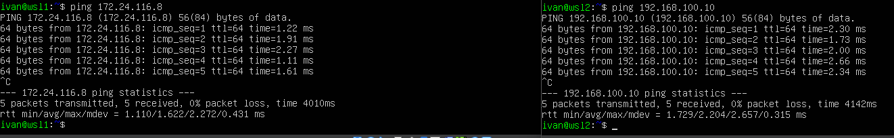  

## Part 3. Утилита iperf3  

 * 3.1. Скорость соединения  
   + 8 Mbps = 1 mb/s  
   + 100 Mbps = 12.5 mb/s  
   + 1 Gbps = 125 mb/s  

 * 3.2. Утилита iperf3   
   + Измерь скорость соединения между ws1 и ws2.  
   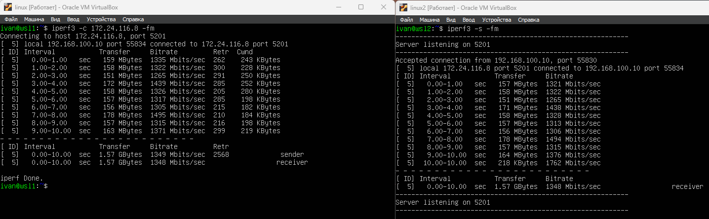  

   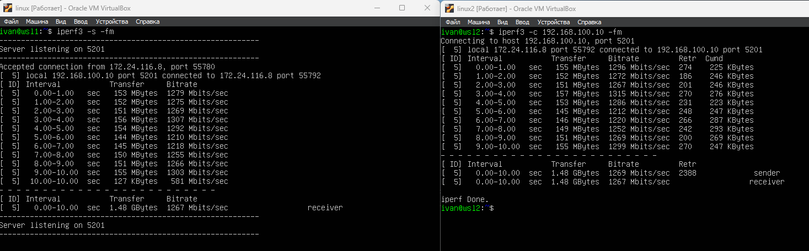  

## Part 4. Сетевой экран  
 * 4.1. Утилита iptables  
   `firewall.sh на ws1 и ws2`  
   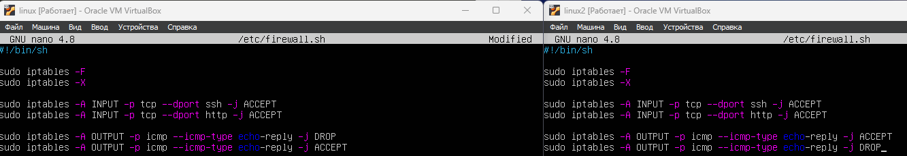  

 * 4.2. Утилита nmap  
   `ping result`  
   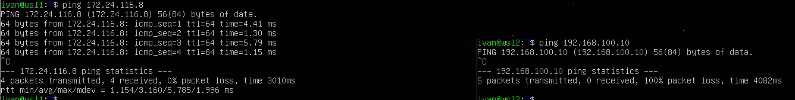  
   `nmap result`  
   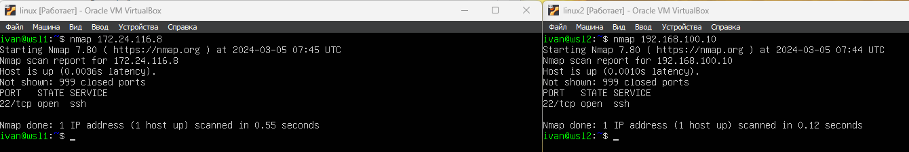  

## Part 5. Статическая маршрутизация сети  
 * 5.1. Настройка адресов машин  
   + Настрой конфигурации машин в etc/netplan/00-installer-config.yaml согласно сети на рисунке.  
   `conf ws11, ws21, ws22`  
  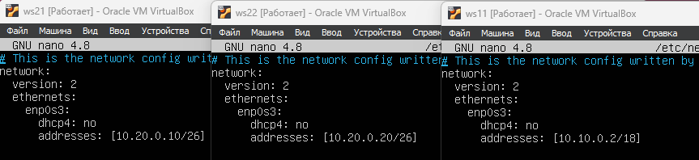  
   `conf r1, r2`  
  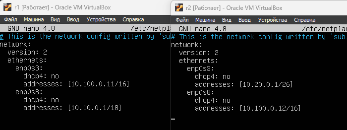  

   + Перезапусти сервис сети. Если ошибок нет, то командой ip -4 a проверь, что адрес машины задан верно. Также пропингуй ws22 с ws21. Аналогично пропингуй r1 с ws11.  
   `ip -4 a ws21, ws22, r2`  
  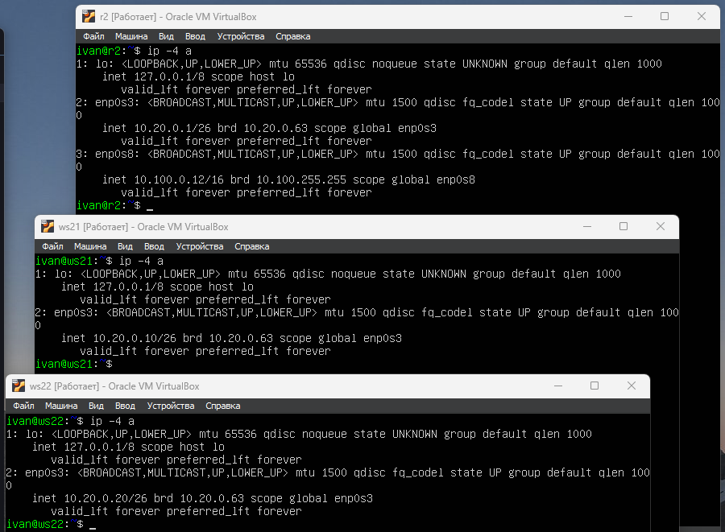  
   `ip -4 a ws11, r1`  
  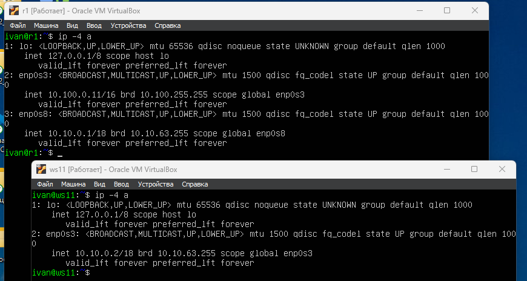  

   `ping ws22 ws21`  
   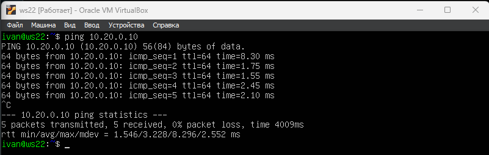  
   `ping r1 ws11`  
   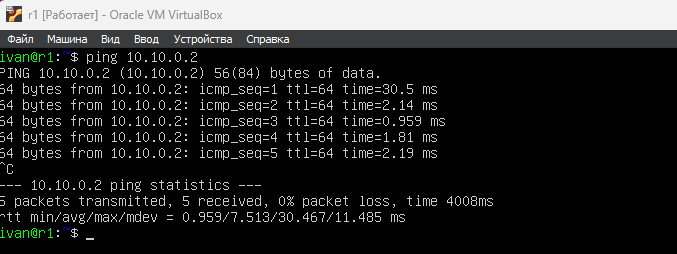  
 
 * 5.2. Включение переадресации IP-адресов  
   + Для включения переадресации IP, выполни команду `sysctl -w net.ipv4.ip_forward=1` на роутерах:  
   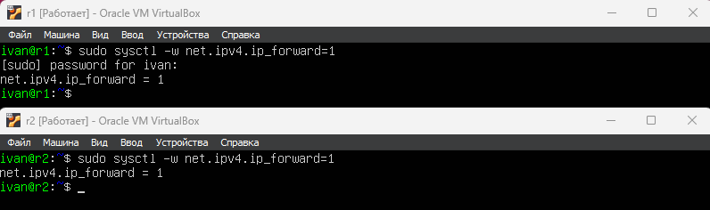  
   + Открой файл /etc/sysctl.conf и добавь в него следующую строку `net.ipv4.ip_forward = 1`:  
   `net.ipv4.ip_forward = 1 r1`  
   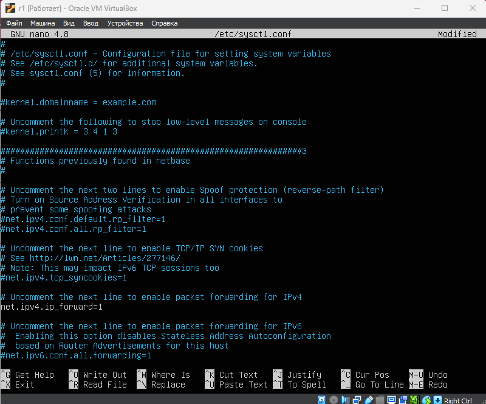  
   `net.ipv4.ip_forward = 1 r2`  
   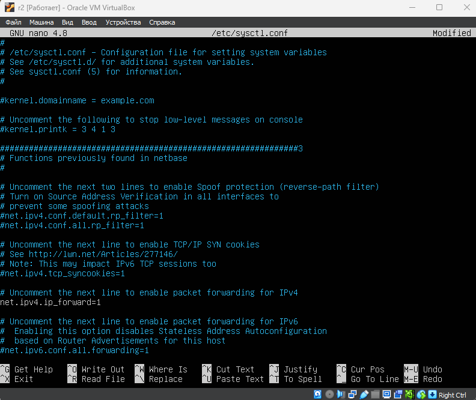  

 * 5.3. Установка маршрута по-умолчанию  
   + Настрой маршрут по-умолчанию (шлюз) для рабочих станций. Для этого добавь default перед IP роутера в файле конфигураций.  
   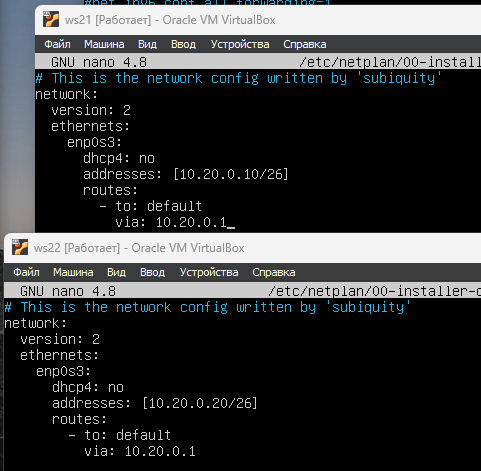  
   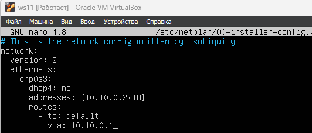  

   + Вызови ip r и покажи, что добавился маршрут в таблицу маршрутизации.  
   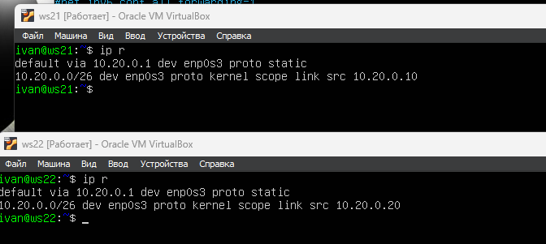  
   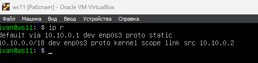  

   + Пропингуй с ws11 роутер r2 и покажи на r2, что пинг доходит. Для этого используй команду:   
   `tcpdump -tn -i enp0s8`  
   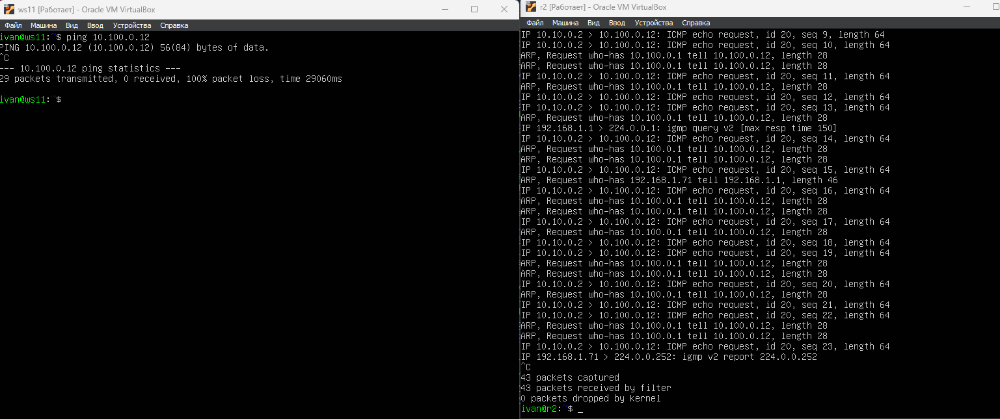  

 * 5.4. Добавление статических маршрутов  
   + Добавь в роутеры r1 и r2 статические маршруты в файле конфигураций. Пример для r1 маршрута в сетку 10.20.0.0/26:  
   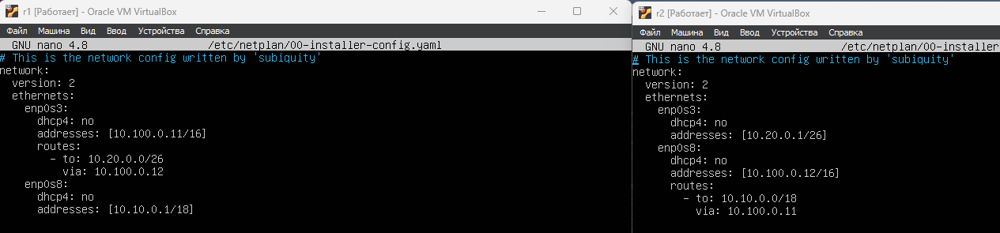  

   + Вызови ip r и покажи таблицы с маршрутами на обоих роутерах. Пример таблицы на r1:  
   `ip r r1 , r2`  
   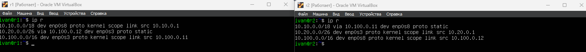  

   + Запусти команды на ws11:  
    `ip r list 10.10.0.0/[маска сети] и ip r list 0.0.0.0/0`  
   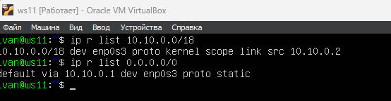  

     В отчёте объясни, почему для адреса 10.10.0.0/[маска сети] был выбран маршрут, отличный от 0.0.0.0/0, хотя он попадает под маршрут по-умолчанию.  

      Из за того что этот адрес `10.10.0.0/[маска сети]` имеет конкретику, то он более приоритетный при выборе маршрута.  

* 5.5. Построение списка маршрутизаторов  

   + Запусти на r1 команду дампа `tcpdump -tnv -i eth0`.  
   +  При помощи утилиты traceroute построй список маршрутизаторов на пути от ws11 до ws21.  
   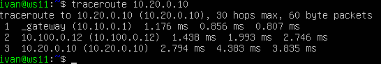  
   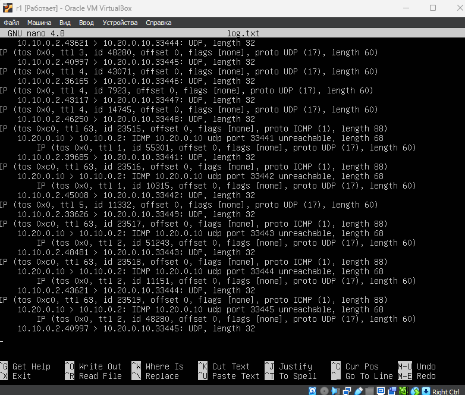  
   Traceroute - это утилита, которая используется для определения маршрута данных от отправителя к получателю в сети TCP/IP. При помощи traceroute отправляются пакеты данных с увеличивающимся значением TTL (Time to Live) в заголовке IP. Когда пакет достигает узла на пути с сниженным TTL, данный узел отправляет сообщение ICMP "Time Exceeded" обратно отправителю. Таким образом, traceroute определяет каждый узел на маршруте до целевого узла.
   Из вывода, полученного из дампа на r1, можно увидеть последовательное изменение TTL в пакетах, направленных к целевому узлу. Как только TTL в пакете становится равным 0, узел на пути отправляет обратно сообщение об ошибке, и traceroute продолжает отправку пакетов с увеличенным TTL.
   Таким образом, принцип работы построения пути при помощи traceroute основан на переборе узлов на маршруте к целевому узлу путем поочередной отправки пакетов с изменяющимся значением TTL и анализа ответов от узлов на пути.  

 * 5.6. Использование протокола ICMP при маршрутизации  
   + Запусти на r1 перехват сетевого трафика, проходящего через eth0 с помощью команды `tcpdump -n -i eth0 icmp`.  
   + Пропингуй с ws11 несуществующий IP (например, 10.30.0.111) с помощью команды `ping -c 1 10.30.0.111`.  
   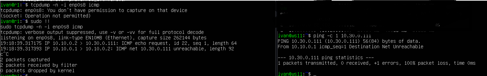  

## Part 6. Динамическая настройка IP с помощью DHCP  

 * Для r2 настрой в файле /etc/dhcp/dhcpd.conf конфигурацию службы DHCP:  
    1) Укажи адрес маршрутизатора по-умолчанию, DNS-сервер и адрес внутренней сети.  
  `/etc/dhcp/dhcpd.conf`  
  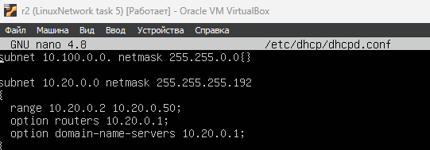  
  2) В файле resolv.conf пропиши nameserver 8.8.8.8.  
  `/etc/resolve.conf`  
  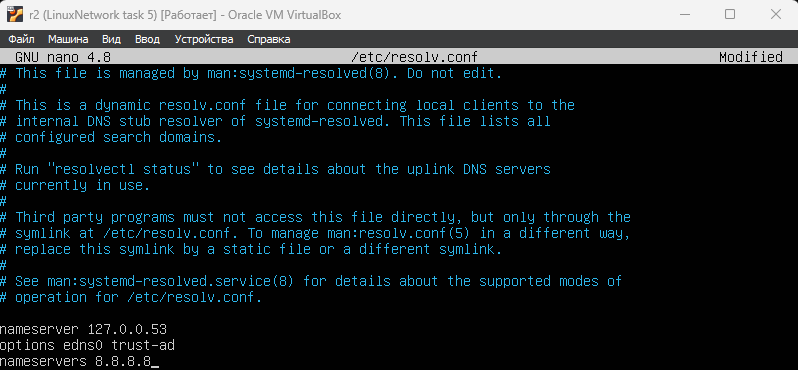  

 * Перезагрузи службу DHCP командой systemctl restart isc-dhcp-server. Машину ws21 перезагрузи при помощи reboot и через ip a покажи, что она получила адрес. Также пропингуй ws22 с ws21.   
  `systemctl restart isc-dhcp-server`  
  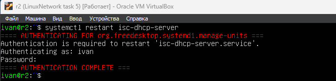  
  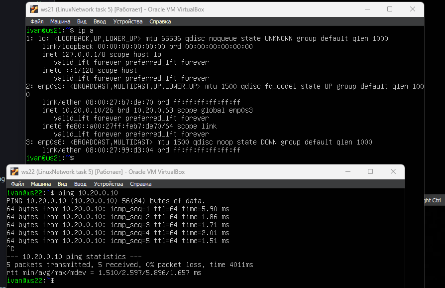  

  Укажи MAC адрес у ws11, для этого в etc/netplan/00-installer-config.yaml надо добавить строки: macaddress: 10:10:10:10:10:BA, dhcp4: true.  
  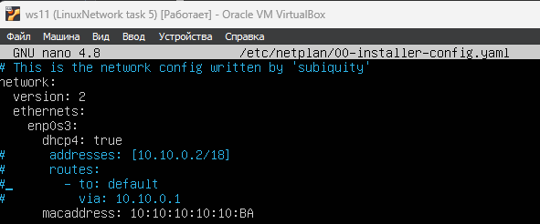  

  Для r1 настрой аналогично r2, но сделай выдачу адресов с жесткой привязкой к MAC-адресу (ws11). Проведи аналогичные тесты.  

  `dhcp.conf r1`  
  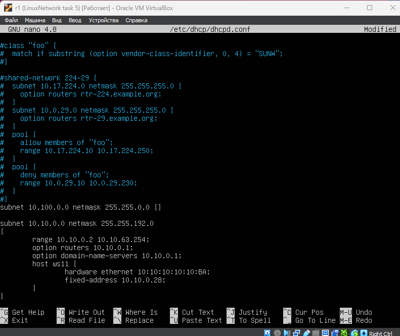  
 
  `resolv.conf r1`  
    

  `systemctl restart isc-dhcp-server r1`  
  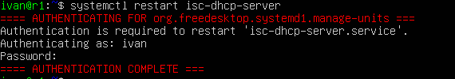  

  `ip a ws11`  
  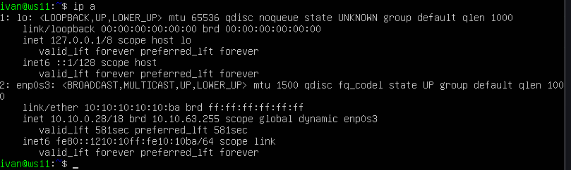  

  ` ip a до`  
  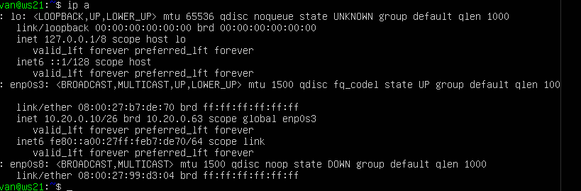  

  `sudo dhclient -r явно освобождает текущую аренду, и как только аренда будет освобождена, клиент завершает работу.`  

  `sudo dhclient Теперь получите новый IP-адрес с помощью DHCP в Linux`  

  ` ip a после`  
  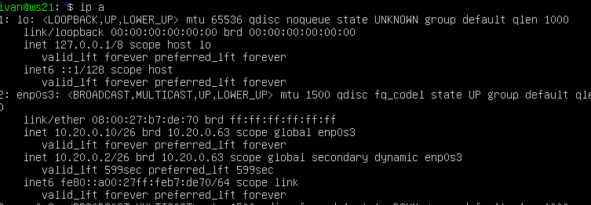  

  ## Part 7. NAT
 * В файле /etc/apache2/ports.conf на ws22 и r1 измени строку Listen 80 на Listen 0.0.0.0:80, то есть сделай сервер Apache2 общедоступным. 
  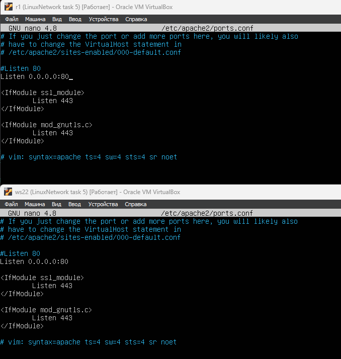 

 * Запусти веб-сервер Apache командой service apache2 start на ws22 и r1. 
  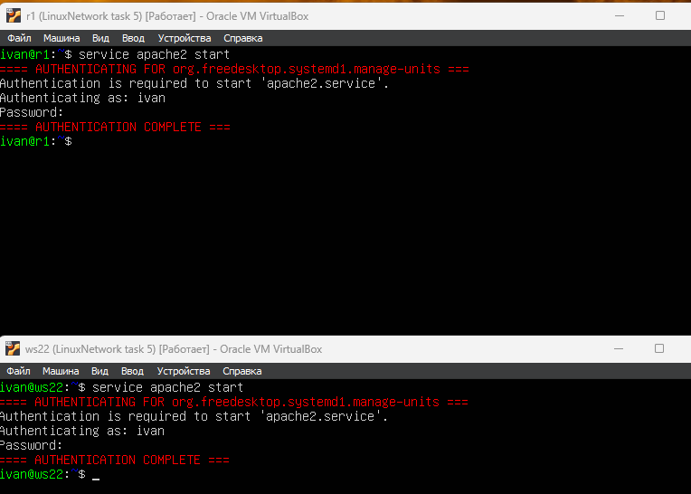 

 * Добавь в фаервол, созданный по аналогии с фаерволом из Части 4, на r2 следующие правила: 
1) Удаление правил в таблице filter - iptables -F; 
2) Удаление правил в таблице "NAT" - iptables -F -t nat; 
3) Отбрасывать все маршрутизируемые пакеты - iptables --policy FORWARD DROP. 
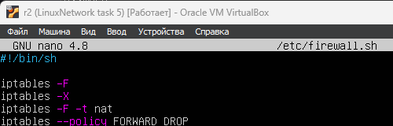 
 Запусти файл также, как в Части 4. 
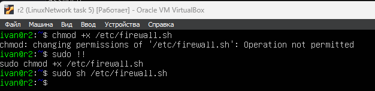 
Проверь соединение между ws22 и r1 командой ping. 
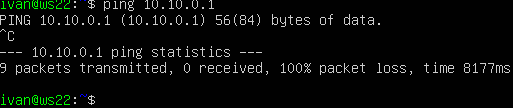 

 * Добавь в файл ещё одно правило: 
4) Разрешить маршрутизацию всех пакетов протокола ICMP. 
  Запусти файл также, как в Части 4. 
  Проверь соединение между ws22 и r1 командой ping. 
  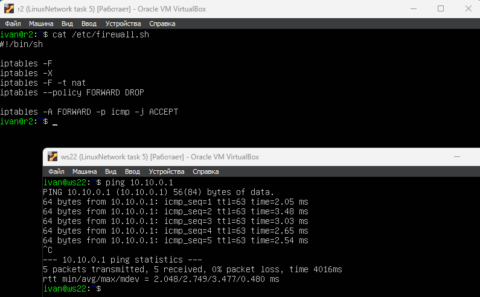 

* Добавь в файл ещё два правила: 

5) Включи SNAT, а именно маскирование всех локальных ip из локальной сети, находящейся за r2 (по обозначениям из Части 5 - сеть 10.20.0.0). 
6) Включи DNAT на 8080 порт машины r2 и добавить к веб-серверу Apache, запущенному на ws22, доступ извне сети. 

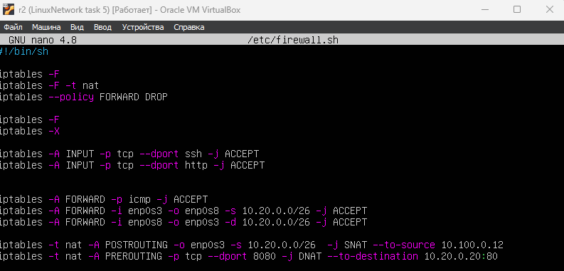 
  Проверь соединение по TCP для SNAT: для этого с ws22 подключиться к серверу Apache на r1 командой:
  `telnet [адрес] [порт]` 
  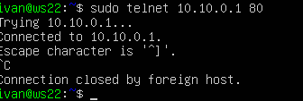 

  Проверь соединение по TCP для DNAT: для этого с r1 подключиться к серверу Apache на ws22 командой telnet (обращаться по адресу r2 и порту 8080). 
  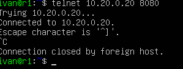 

  ## Part 8. Дополнительно. Знакомство с SSH Tunnels 

  * Запусти на r2 фаервол с правилами из Части 7. 
  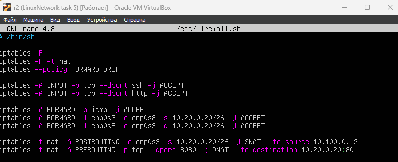 
  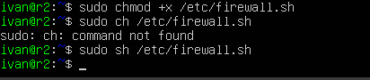 
  * Запусти веб-сервер Apache на ws22 только на localhost (то есть в файле /etc/apache2/ports.conf измени строку Listen 80 на Listen localhost:80). 
  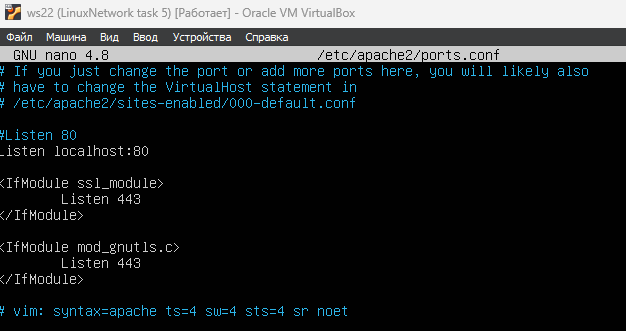 

 * Воспользуйся Local TCP forwarding с ws21 до ws22, чтобы получить доступ к веб-серверу на ws22 с ws21. 
  `ssh -L 9999:localhost:80 ivan@10.20.0.20` 
  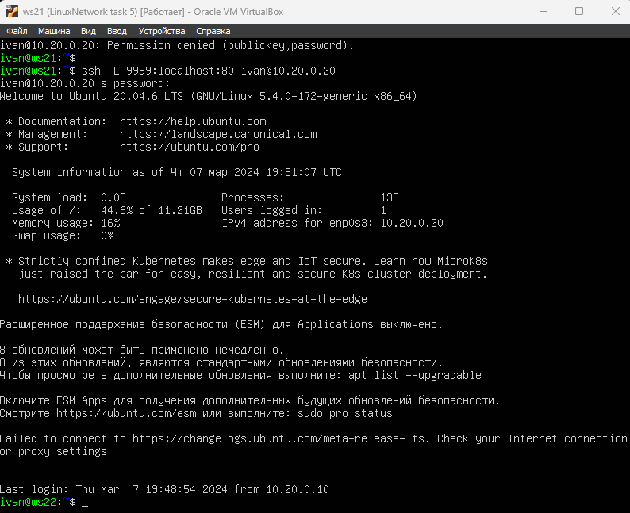 
  `telnet localhost 9999 и netstat с портом 9999` 
  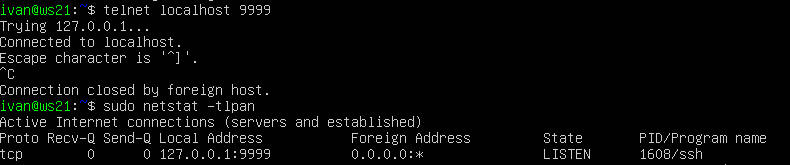 

  * Воспользуйся Remote TCP forwarding c ws11 до ws22, чтобы получить доступ к веб-серверу на ws22 с ws11. 
  `ssh -R 9999:localhost:80 ivan@10.20.0.10` 
  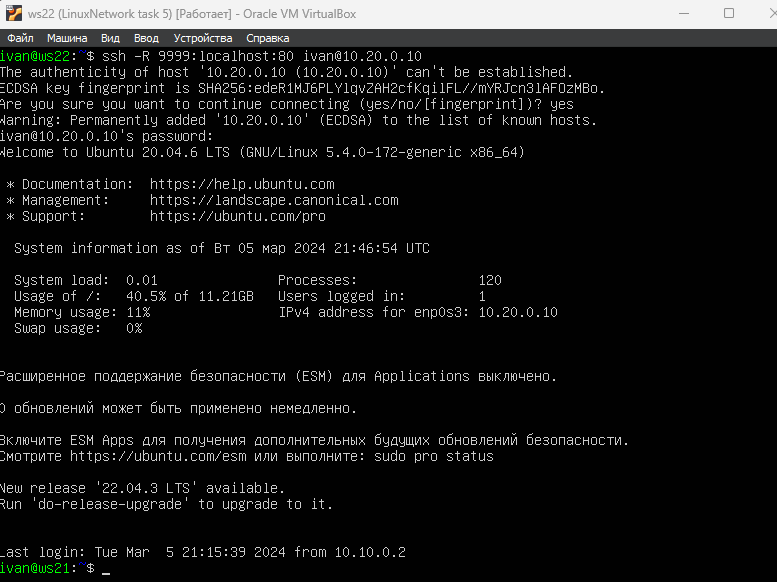 
  `telnet localhost 9999 и netstat с портом 9999` 
  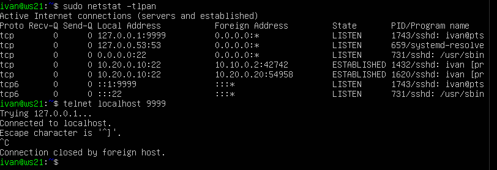 