## Part 1. Установка ОС
`cat /etc/issue`  

* 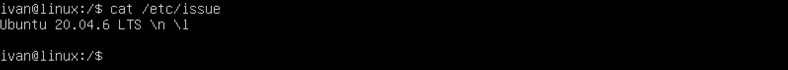

## Part 2. Создание пользователя
`sudo adduser scarecrb`  

* 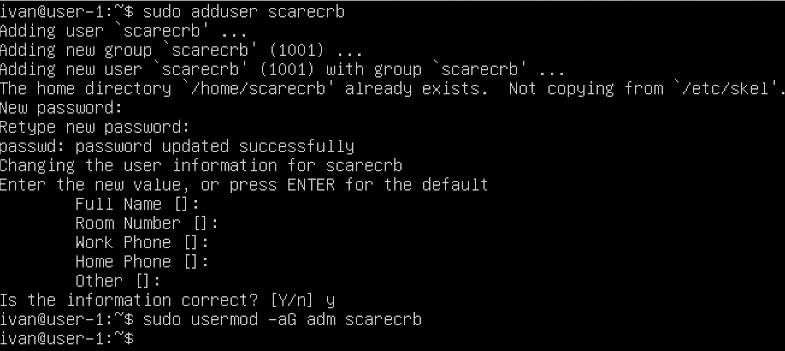

`cat /etc/passwd | grep ^scarecrb`  

* 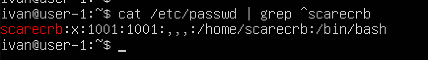

## Part 3. Настройка сети ОС

* С помощью команды sudo nano /etc/hostname изменил содержимое файла на user-1, затем перезагрузил машину.
* Используя команду sudo dpkg-reconfigure tzdata далее следовал инструкциям, где нужно выбрать часовой пояс.   
    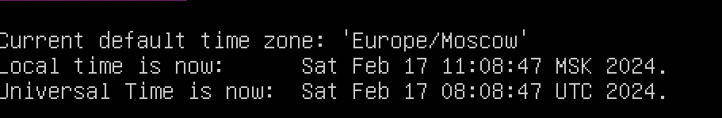

* Командой ip l вывожу все сетевые интерфейсы.
    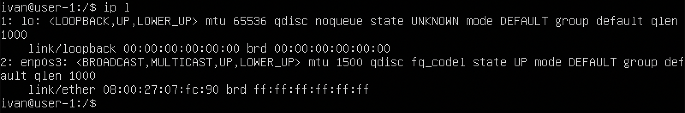 

    + Локальный интерфейс loopback важен для связи двух приложений в рамках одного компьютера. например веб сервер и база данных, которые должны общаться внутри одной и той же системы,и в итоге нет нужды использовать настоящий сетевой интерфейс , потому что есть внутренний интерфейс loopback. И так как данные перемещаются внутри компьютера, то не нужно заботиться о том, что потеряются пакеты и какие то вещи на более низких уровнях, нежели настоящий сетевой интерфейс.  

* Командой ip a вывожу все ip адреса, связанные с сетевыми интерефейсами. И на скриншоте вывожу свой ip адрес выделенный динамически по протоколу dhcp.
    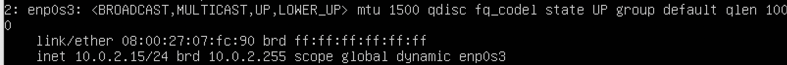
    + DHCP позволяет устройствам автоматически получать IP-адрес, шлюз по умолчанию, DNS-серверы и другие параметры сети без необходимости ручной настройки каждого устройства.

* Внешний ip-адрес шлюза (ip) 
    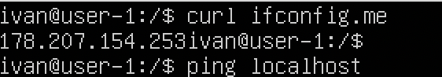
  
  Внутренний IP-адрес шлюза, он же ip-адрес по умолчанию (gw) 
    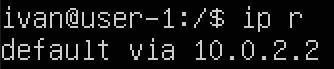
    
* Задаю статические данные в конфигурационном файле /etc/netplan/00-installer-config.yaml 

    `sudo nano /etc/netplan/00-installer-config.yaml `
    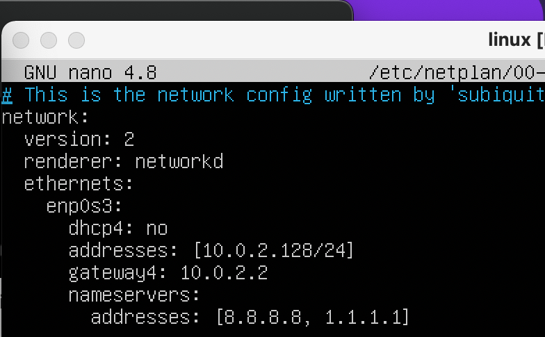

    Затем принимаю изменения
    `sudo netplan apply`

* После перезагрузки ВМ проверил сетевые настройки, они не изменились.
    `ip a`
    

    Пингую ya.ru
    `ping ya.ru`
    

    Пингую 1.1.1.1
    `ping 1.1.1.1`
    

## Part 4. Обновление ОС
   * `Результат выполнения команды sudo apt update`
    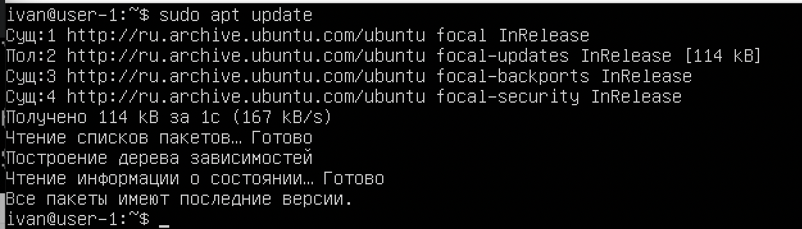

## Part 5. Использование команды sudo

* Назначение команды sudo - обеспечить безопасное выполнение привилегированных операций, таких как установка программ, изменение системных настроек, управление пользователями и файлами, без необходимости входа в систему под администраторским пользователем. Это помогает предотвратить случайное или злонамеренное повреждение системы, а также уменьшает риск утечки пароля администратора.

* Изменяю конфигурации sudo. 
    `sudo visudo`
    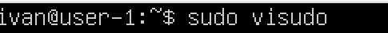

    Добавляю возможность другому пользователю использовать sudo.
    `Изменил конфигурции sudo`
    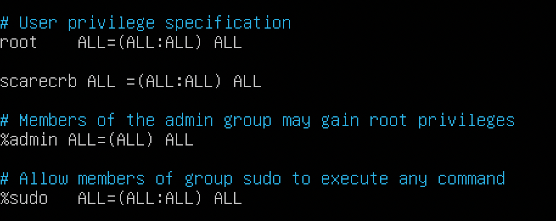

    Меняю пользователя на созданного во второй части задания.
    `su scarecrb`
    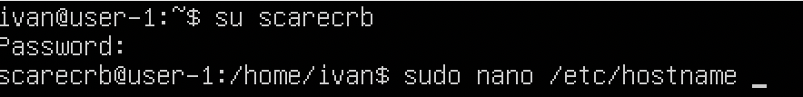

    Меняю hostname с помощью команды sudo на user-12345
    `sudo nano /etc/hostname`
    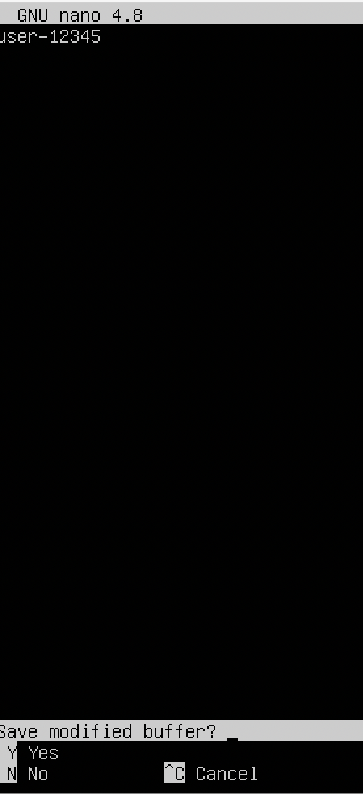

* Результат смены hostname после перезапуска машины.
    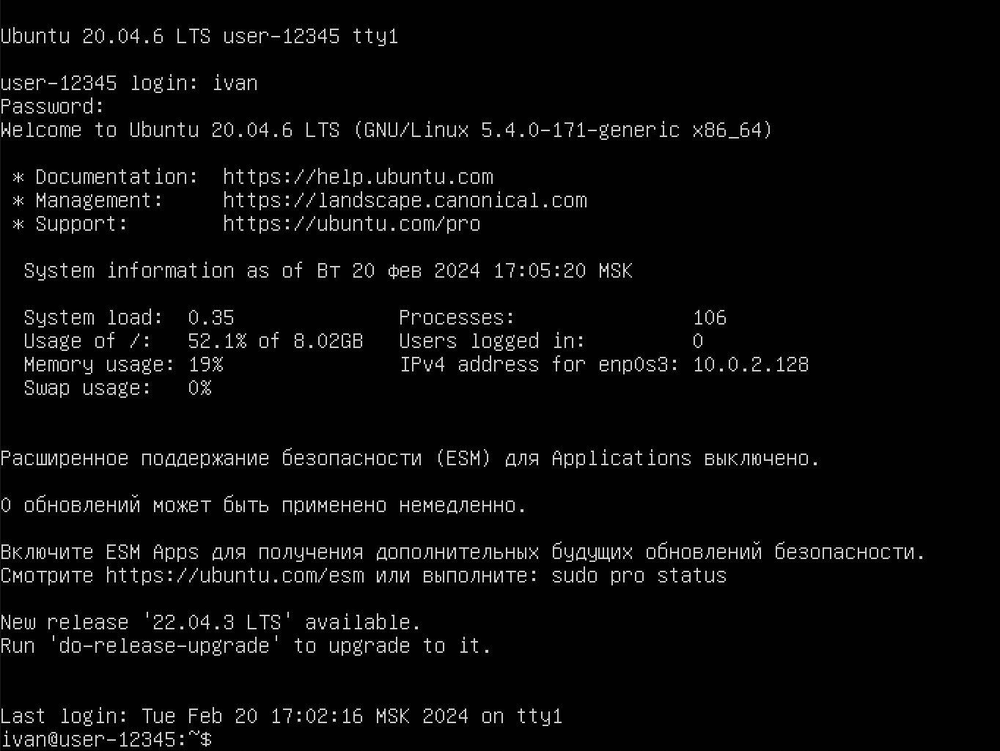

## Part 6. Установка и настройка службы времени

* Выведи время часового пояса, в котором ты сейчас находишься.
    `timedatectl`
    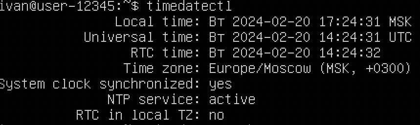

    Вывод следующей команды должен содержать NTPSynchronized=yes:  timedatectl show
    `timedatectl show`
    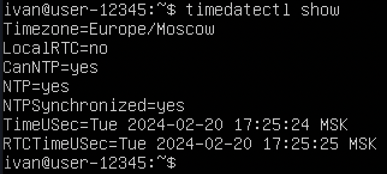

## Part 7. Установка и использование текстовых редакторов

* Напиши в файле свой никнейм, закрой файл с сохранением изменений.

    + vim: esc, : , x , enter;
    
    + nano: ctrl + X, Y, enter;
    
    + mcedit: esc, Выбрал сохранить перед выходом и enter; 
    
* Открыть файл на редактирование, отредактируй файл, заменив никнейм на строку «21 School 21», закрой файл без сохранения изменений.

    + vim: esc, shift + z , shift + q;
    
    + nano: ctrl + X, N;
    
    + mcedit: esc, Выбрал не сохранить перед выходом и enter; 
    

* Отредактировать файл ещё раз (по аналогии с предыдущим пунктом), а затем освой функции поиска по содержимому файла (слово) и замены слова на любое другое.

    + nano: ctrl + W , ввел слово которое ищу(scarecrb), enter;
    
    + nano: opt + r, ввел слово, которое будет измененно(scarecrb), ввел новое слово(s21_school), соглашаюсь с заменой (Y);
    

    + vim: ставлю слэш (/) , затем искомое слово (scarecrb) и enter;
    
    + vim: нажимаю :s/scarecrb/school + enter;
    

    + mcedit: fn + 7 ввожу искомое слово (scarecrb) , enter
    
    + mcedit: fn + 4 ввожу искомое слово (scarecrb), ввожу новое слово(school) enter
    

## Part 8. Установка и базовая настройка сервиса SSHD

* Установи службу SSHd.

   Командой  `sudo apt install openssh-server` я устанавливаю SSH.

* Добавь автостарт службы при загрузке системы.

    Команда `sudo systemctl enable ssh`  добавляет SSH в автозагрузку.

* Перенастрой службу SSHd на порт 2022.

    + Командой `sudo nano /etc/ssh/sshd_config` редактирую файл, прописываю `Port 2022` и сохраняю изменения.
    

    + Далее командой `sudo systemctl restart sshd` перезапускаю demon SSH.
    Командой `netstat -atp` смотрю , что есть строка tcp: 0.0.0.0:2022 : listen. Значит порт успешно используется.
    

* Используя команду ps, покажи наличие процесса sshd. Для этого к команде нужно подобрать ключи.
    + Результат команды `ps -aux | grep sshd`
    
    + `ps` - утилита, основная задача которой - это отображение информации обо всех запущенных процессах
    + `Опция -a` указывает ps перечислить процессы всех пользователей в системе, а не только текущего пользователя, за исключением лидеров групп и процессов, не связанных с терминалом.
    + `Опция -u` указывает ps предоставить подробную информацию о каждом процессе. 
    + `Опция -x` добавляет в список процессы, у которых нет управляющего терминала, такие как демоны, которые представляют собой программы, запускаемые во время загрузки и незаметно работающие в фоновом режиме, пока они не будут активированы определенным событием или условием.

* Перезагрузи систему.

    + Команда `netstat` предназначена для получения сведений о состоянии сетевых соединений и слушаемых на данном компьютере портах TCP и UDP, а также для отображения статистических данных по сетевым интерфейсам и протоколам.
    
    + `a` — отображение всех подключений и ожидающих портов;
    + `t` - отображает TCP порты;
    + `n` - Показывать сетевые адреса как числа;
    + `0.0.0.0` - это немаршрутизируемый адрес IPv4, который используется в качестве адреса по умолчанию или адреса-заполнителя.

## Part 9. Установка и использование утилит top, htop

* Установи и запусти утилиты top и htop.
    + По выводу команды top определи и напиши в отчёте:
        - uptime: 20 min;
        - user: 1;
        - load average: 0,00 0,00 0,00
        - Tasks: 97;
        - %Cpu(s): 0,0 us, 0,0 sy, 0,0 ni, 100,0 id, 0,0 wa, 0,0 hi, 0,0 si, 0,0 st;
        - MiB Mem: 965,1 total, 365,8 free 202,9 used. 396,4 buff/cache;
        - pid процесса занимающего больше всего памяти: 1;
        - pid процесса, занимающего больше всего процессорного времени: 1142;
    + В отчёт вставь скрин с выводом команды htop:
        - отсортированному по PID, PERCENT_CPU, PERCENT_MEM, TIME: 
        `PID`
        
        `PERCENT_CPU`
        
        `PERCENT_MEM`
        
        `TIME`
        

        - отфильтрованному для процесса sshd
        

        - с процессом syslog, найденным, используя поиск
        

        - с добавленным выводом hostname, clock и uptime
        

## Part 10. Использование утилиты fdisk
 * Запусти команду fdisk -l.
    + название жесткого диска: /dev/sda
    + размер: 10 GiB, 10737418240 bytes
    + количество секторов: 20971520
    + размер swap: 1515516

## Part 11. Использование утилиты df
 * Запусти команду df.
    + В отчёте напиши для корневого раздела (/):
        - размер раздела: 8408452
        - размер занятого пространства: 4852688
        - размер свободного пространства: 3107048
        - процент использования: 61%
    + Определи и напиши в отчёт единицу измерения в выводе.
        - Килобайты.
 * Запусти команду df -Th.
    + В отчёте напиши для корневого раздела (/):
        - размер раздела: 8,1G
        - размер занятого пространства: 4,7G 
        - размер свободного пространства: 3,0G
        - процент использования: 61%
    + Определи и напиши в отчёт тип файловой системы для раздела.
        - ext4;

## Part 12. Использование утилиты du

 * Запусти команду du  
 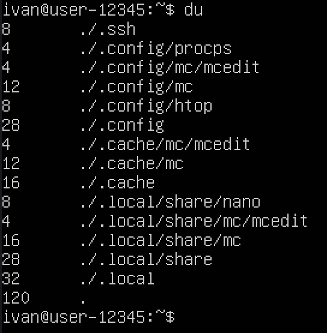

 * Выведи размер папок /home, /var, /var/log (в байтах, в человекочитаемом виде) 
    `du -h ../../home` 
    

    `du -h ../../var`
    

    `du -h ../../var/log`
    

 * Выведи размер всего содержимого в /var/log (не общее, а каждого вложенного элемента,     используя *)

    `du -h ../../var/log/*`
    

## Part 13. Установка и использование утилиты ncdu

 * Установи утилиту ncdu 
    `sudo apt install ncdu -y`
    

 * Выведи размер папок /home, /var, /var/log

    `ncdu ../../home`
    

    `ncdu ../../var`
    

    `ncdu ../../var/log`
    

## Part 14. Работа с системными журналами
    
 * Последняя аутентификация.
    
 * Перезапусти службу SSHd;
 * Вставь в отчёт скрин с сообщением о рестарте службы (искать в логах).
    

## Part 15. Использование планировщика заданий CRON
 * Используя планировщик заданий, запусти команду uptime через каждые 2 минуты.

    + Найди в системных журналах строчки (минимум две в заданном временном диапазоне) о выполнении;
     
    + Выведи на экран список текущих заданий для CRON;
     
    + Вставь в отчёт скрины со строчками о выполнении и списком текущих задач.

 * Удали все задания из планировщика заданий.

    + В отчёт вставь скрин со списком текущих заданий для CRON. 
     