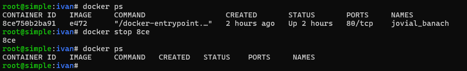
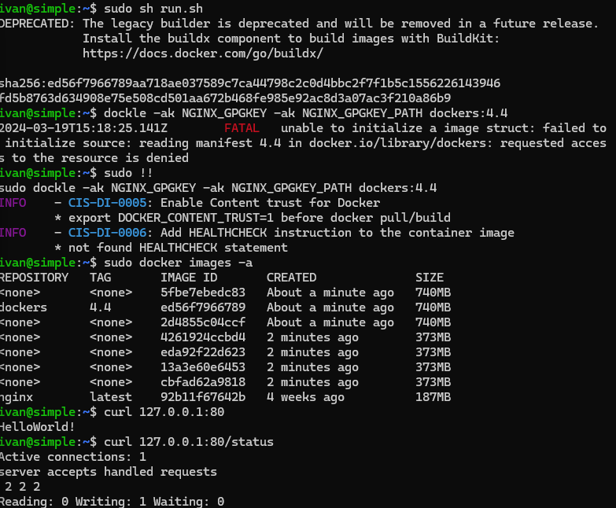
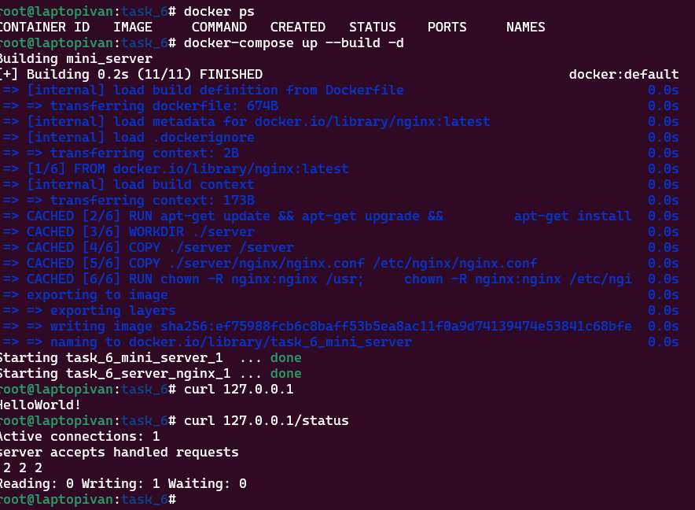

## Part 1. Готовый докер  

 * Возьми официальный докер-образ с nginx и выкачай его при помощи `docker pull`.  
      
 * Проверь наличие докер-образа через `docker images`.  
 * Запусти докер-образ через `docker run -d [image_id|repository]`  
 * Проверь, что образ запустился через `docker ps`.  
      
 * Посмотри информацию о контейнере через `docker inspect [container_id|container_name]`.  
 * По выводу команды определи и помести в отчёт:  
 `размер контейнера`:   
    `sizerootfs` определяет размер корневой файловой системы в контейнере, т.е. объем дискового пространства, выделенного для основных системных файлов контейнера.   
       
 `список замапленных портов`:  
      
 `ip контейнера`:  
      
 * Останови докер образ через `docker stop [container_id|container_name]`.  
 * Проверь, что образ остановился `через docker ps`.  
      
 * Запусти докер с портами `80` и `443` в контейнере, замапленными на такие же порты на локальной машине, через команду `run`.  
      
 * Проверь, что в браузере по адресу `localhost:80` доступна стартовая страница nginx.  
 `здесь момент ввода localhost:80, так как на загруженной странице порт затирается`  
      
      
 * Перезапусти докер контейнер через `docker restart [container_id|container_name]`.  
 * Проверь любым способом, что контейнер запустился.  
      

## Part 2. Операции с контейнером 
 * Прочитай конфигурационный файл `nginx.conf` внутри докер контейнера через команду exec.   
      
 * Создай на локальной машине файл `nginx.conf`.  
 * Настрой в нем по пути `/status` отдачу страницы статуса сервера nginx.  
      
 * Скопируй созданный файл nginx.conf внутрь докер-образа через команду docker cp.  
 * Перезапусти nginx внутри докер-образа через команду exec.  
      
 * Проверь, что по адресу localhost:80/status отдается страничка со статусом сервера nginx.  
      
* Экспортируй контейнер в файл container.tar через команду export.
* Останови контейнер.  
      
 * Удали образ через docker rmi [image_id|repository], не удаляя перед этим контейнеры. (здесь я не понял, либо хотят показать, что нельзя просто так удалить образ, который используется контейнером(даже остановленным), либо показать что есть опция --force (не указаная в задании). Выбрал второе так как просят всё равно удалить).   
 * Удали остановленный контейнер.  
      
 * Импортируй контейнер обратно через команду `import`.  
 * Запусти импортированный контейнер.  
      
 * Проверь, что по адресу localhost:80/status отдается страничка со статусом сервера nginx.  
      

## Part 3. Мини веб-сервер
 * Напиши мини-сервер на C и FastCgi, который будет возвращать простейшую страничку с надписью `Hello World!`.  
     
 * Запусти написанный мини-сервер через `spawn-fcgi` на порту 8080.  
     
 * Напиши свой nginx.conf, который будет проксировать все запросы с 81 порта на `127.0.0.1:8080`.  
     
 * Проверь, что в браузере по `localhost:81` отдается написанная тобой страничка.  
     
 * Положи файл `nginx.conf` по пути `./nginx/nginx.conf` (это понадобится позже).  
     

## Part 4. Свой докер
 * Напиши свой докер-образ, который:  
   1) собирает исходники мини сервера на `FastCgi` из Части 3;  
   2) запускает его на `8080` порту;  
   4) запускает nginx.  
     
   3) копирует внутрь образа написанный `./nginx/nginx.conf`;  
     

 * Собери написанный докер-образ через `docker build` при этом указав имя и тег.  
 * Проверь через `docker images`, что все собралось корректно.  
     
 * Запусти собранный докер-образ с `маппингом 81 порта на 80` на локальной машине и маппингом папки `./nginx` внутрь контейнера по адресу, где лежат конфигурационные файлы `nginx'а`  
     
 * Проверь, что по `localhost:80` доступна страничка написанного мини сервера.  
 * Допиши в ./nginx/nginx.conf проксирование странички /status, по которой надо отдавать статус сервера nginx.  
   
 * Перезапусти докер-образ.  
`Если всё сделано верно, то, после сохранения файла и перезапуска контейнера, конфигурационный файл внутри докер-образа должен обновиться самостоятельно без лишних действий`  
 * Проверь, что теперь по localhost:80/status отдается страничка со статусом nginx  
   

## Part 5. Dockle
 * Просканируй образ из предыдущего задания через dockle `[image_id|repository]`.  
     
 * Исправь образ так, чтобы при проверке через dockle не было ошибок и предупреждений.  
     
   `Исправленный Dockerfile`  
     

## Часть 6. Базовый Docker Compose  
 * Напиши файл docker-compose.yml, с помощью которого:  

1) Подними докер-контейнер из Части 5 (он должен работать в локальной сети, т.е. не нужно использовать инструкцию EXPOSE и мапить порты на локальную машину).  
2) Подними докер-контейнер с nginx, который будет проксировать все запросы с 8080 порта на 81 порт первого контейнера.  
Замапь 8080 порт второго контейнера на 80 порт локальной машины.  
  
Останови все запущенные контейнеры.  
Собери и запусти проект с помощью команд `docker-compose build и docker-compose up`.  
Проверь, что в браузере по `localhost:80` отдается написанная тобой страничка, как и ранее.  
